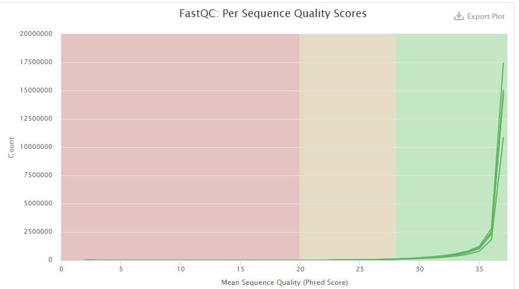
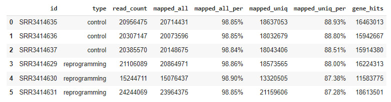
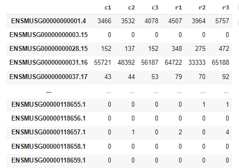
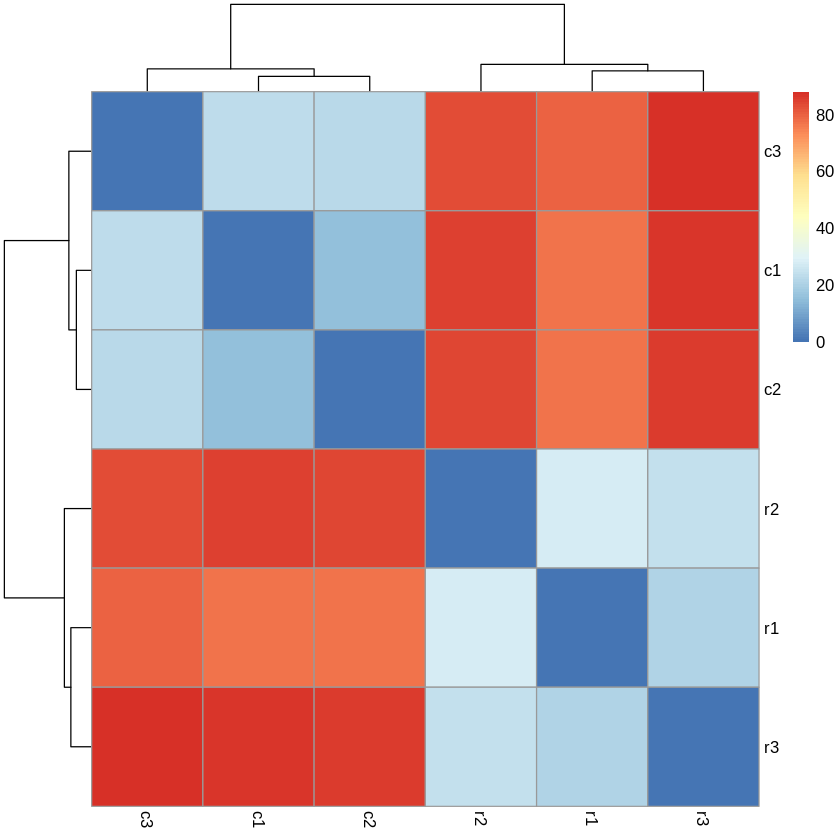
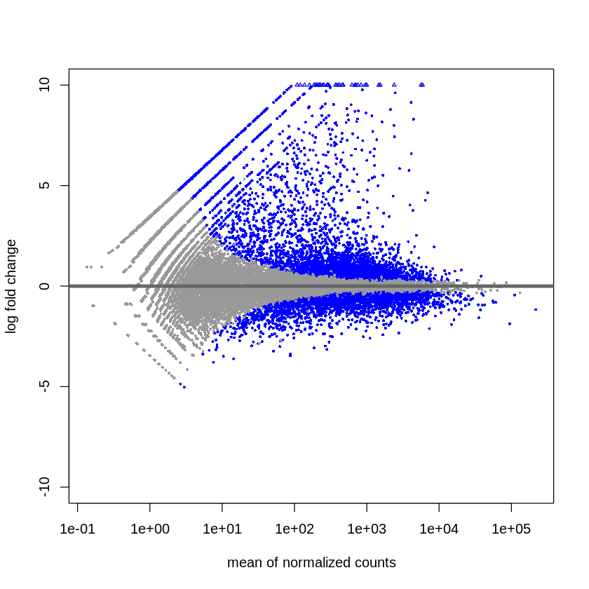
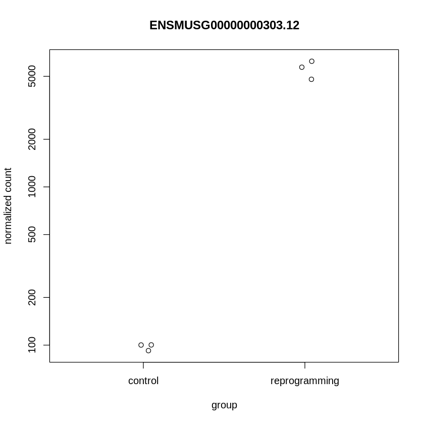
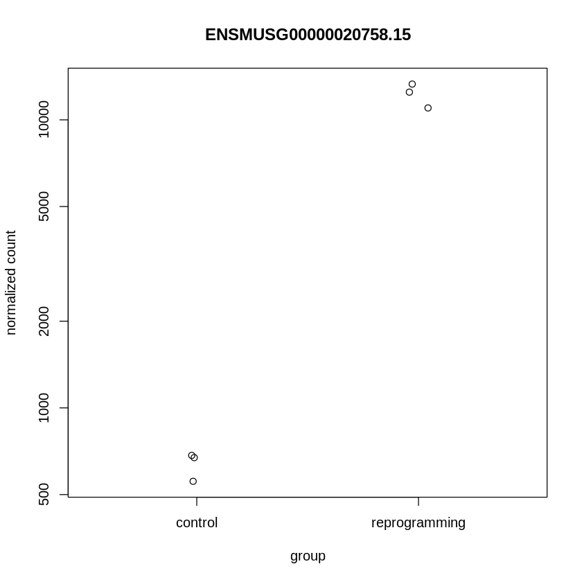

# Домашнее задание №4

Код:  [Colab](https://colab.research.google.com/drive/1XKFa_DzlJDejt9F7eQDlQhBAPRKhyI2x?usp=sharing)

### Скриншот из MultiQC. Исходные риды имеют хорошее качество. 

### Таблица со статистикой по каждому из 6-ти образцов:

* ID образца

* Тип образца (перепрограммированние или контроль)

* Общее кол-во исходных чтений

* Кол-во и процент чтений, которые были успешно откартированы на геном (уникально или нет)

* Кол-во и процент уникально откартированных чтений

* Общее кол-во чтений, которые попали на гены

### Таблица ALL.counts с кол-вом попаданий ридов для каждого гена:

# БОНУС

Код:  [Colab](https://colab.research.google.com/drive/1dsrZ7rG84w6nVxQgCjSy_3OAG1qC49rO?usp=sharing)

## Графики из анализа DESeq2 (бонус)

### Тепловая карта

На диагонале отличий нет, внутри теста и контроля отличий мало.

### MA-plot

### Для нескольких генов, которые наиболее значимо поменяли свою экспрессию - графики со значениями 'normalized counts' в контрольных и перепрограммированных образцах

Видим значительное отличие в экспрессии между тестом и контролем.
